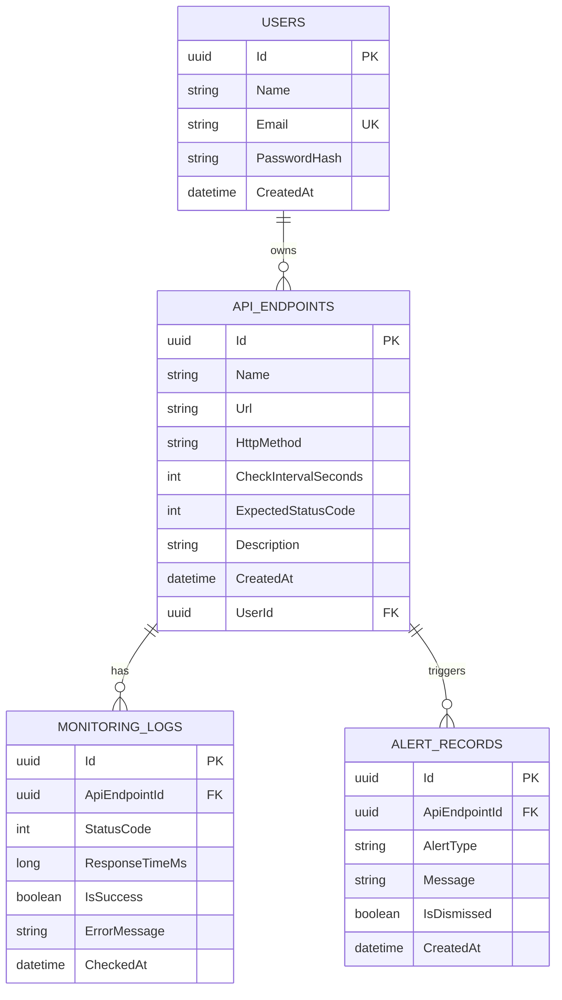

# 🔍 PulseWatch — API Monitoring Dashboard

<div align="center">

**Real-time API health monitoring, uptime tracking, and failure alerting for developers and DevOps teams.**


</div>

---

## 📋 Table of Contents

- [Overview](#-overview)
- [Features](#-features)
- [Tech Stack](#-tech-stack)
- [Architecture](#-architecture)
- [Project Structure](#-project-structure)
- [Getting Started](#-getting-started)
- [API Documentation](#-api-documentation)
- [Frontend Pages](#-frontend-pages)
- [Configuration](#-configuration)
- [Docker Deployment](#-docker-deployment)
- [Database Schema](#-database-schema)

---

## 🎯 Overview

PulseWatch is a full-stack API monitoring platform that allows users to register API endpoints and automatically monitor their health at configurable intervals. It tracks **uptime**, **response time**, **failure rates**, and **status history** — providing real-time insights through a premium dark-themed dashboard.

### Problem It Solves

Developers and companies depend on APIs. If an API becomes slow or stops responding, applications fail. PulseWatch enables teams to **detect API failures early** before they impact end users.

### Target Users

- Developers building API-dependent applications
- Startups managing microservices
- DevOps engineers monitoring production APIs
- Companies with external API integrations

---

## ✨ Features

### Core Monitoring
- **Automated Health Checks** — Background service pings registered APIs at configurable intervals (30s to 30min)
- **Response Time Tracking** — Records response time for every health check
- **Status Detection** — Compares actual HTTP status codes against expected values
- **Failure Alerting** — Automatically creates alert records when an API check fails
- **URL Normalization** — Automatically handles URLs without `http://` prefix

### Dashboard & Analytics
- **Real-time KPI Cards** — Total APIs, Healthy count, Unhealthy count, Average response time
- **API Health Table** — Live status overview of all monitored endpoints
- **Alert Banner** — Dismissible alert notifications for recent failures
- **Auto-refresh** — Dashboard data refreshes automatically every 30 seconds
- **API Detail View** — Per-endpoint analytics with Chart.js visualizations:
  - Response time line chart (last 30 checks)
  - Success vs failure doughnut chart
  - Monitoring log history table

### API Management
- **Full CRUD** — Create, read, update, and delete monitored API endpoints
- **Configurable Parameters** — HTTP method, check interval, expected status code, description
- **Card Grid Layout** — Visual card-based API management interface

### Authentication & Security
- **JWT Authentication** — Secure token-based auth with configurable expiry
- **BCrypt Password Hashing** — Industry-standard password security
- **Route Guards** — Frontend auth guards protect all dashboard routes
- **HTTP Interceptor** — Automatically attaches Bearer tokens to API requests
- **User Isolation** — Each user only sees their own APIs and alerts

---

## 🛠 Tech Stack

| Layer | Technology | Purpose |
|-------|-----------|---------|
| **Backend API** | ASP.NET Core 8 | RESTful API with Clean Architecture |
| **Frontend** | Angular 19 | Standalone components, lazy-loaded routes |
| **Database** | PostgreSQL 16 | Persistent data storage with EF Core |
| **ORM** | Entity Framework Core 8 | Database migrations and queries |
| **Authentication** | JWT Bearer + BCrypt | Secure user authentication |
| **Charts** | Chart.js | Response time and success/failure visualization |
| **Containerization** | Docker Compose | Multi-container orchestration |
| **Reverse Proxy** | Nginx | Frontend serving + API proxy in production |
| **API Docs** | Swagger / OpenAPI | Interactive API documentation |

---

## 🏗 Architecture

### System Architecture

```
┌─────────────────┐     ┌──────────────────┐     ┌─────────────────┐
│                 │     │                  │     │                 │
│   Angular SPA   │────▶│  ASP.NET Core    │────▶│  PostgreSQL 16  │
│   (Port 4200)   │     │  Web API         │     │  (Port 5433)    │
│                 │     │  (Port 5000)     │     │                 │
└─────────────────┘     └──────────────────┘     └─────────────────┘
                              │
                              ▼
                        ┌──────────────┐
                        │  Background  │
                        │  Monitoring  │
                        │  Service     │
                        │  (IHosted    │
                        │   Service)   │
                        └──────────────┘
                              │
                              ▼
                        ┌──────────────┐
                        │  External    │
                        │  APIs being  │
                        │  monitored   │
                        └──────────────┘
```

### Clean Architecture (Backend)

```
PulseWatch.Domain          →  Entities (no dependencies)
PulseWatch.Application     →  DTOs, Interfaces (depends on Domain)
PulseWatch.Infrastructure  →  EF Core, Services (depends on Application + Domain)
PulseWatch.API             →  Controllers, Program.cs (depends on all)
```

---

## 📁 Project Structure

```
PulseWatch/
│
├── PulseWatch.sln                          # .NET Solution file
├── docker-compose.yml                      # Multi-container orchestration
├── .dockerignore                           # Docker build exclusions
├── README.md                               # This file
│
├── backend/
│   ├── PulseWatch.Domain/                  # Domain Layer
│   │   └── Entities/
│   │       ├── User.cs                     # User entity
│   │       ├── ApiEndpoint.cs              # Monitored API endpoint
│   │       ├── MonitoringLog.cs            # Health check result log
│   │       └── AlertRecord.cs              # Failure alert record
│   │
│   ├── PulseWatch.Application/             # Application Layer
│   │   ├── DTOs/
│   │   │   ├── Auth/
│   │   │   │   ├── RegisterRequest.cs      # User registration DTO
│   │   │   │   ├── LoginRequest.cs         # User login DTO
│   │   │   │   └── AuthResponse.cs         # JWT token response DTO
│   │   │   ├── ApiEndpoint/
│   │   │   │   ├── CreateApiRequest.cs     # Create endpoint DTO
│   │   │   │   ├── UpdateApiRequest.cs     # Update endpoint DTO
│   │   │   │   └── ApiEndpointResponse.cs  # Endpoint response DTO
│   │   │   └── Dashboard/
│   │   │       ├── DashboardSummaryResponse.cs  # KPI summary DTO
│   │   │       └── ApiDetailResponse.cs    # Per-API analytics DTO
│   │   └── Interfaces/
│   │       ├── IAuthService.cs             # Auth service contract
│   │       ├── IApiEndpointService.cs      # CRUD service contract
│   │       ├── IDashboardService.cs        # Analytics service contract
│   │       └── IMonitoringService.cs       # Monitoring engine contract
│   │
│   ├── PulseWatch.Infrastructure/          # Infrastructure Layer
│   │   ├── Data/
│   │   │   ├── PulseWatchDbContext.cs      # EF Core DbContext
│   │   │   └── Migrations/                # Auto-generated EF migrations
│   │   └── Services/
│   │       ├── AuthService.cs              # JWT + BCrypt authentication
│   │       ├── ApiEndpointService.cs       # CRUD operations
│   │       ├── DashboardService.cs         # Analytics calculations
│   │       ├── MonitoringService.cs        # Health check logic
│   │       └── MonitoringHostedService.cs  # Background worker (IHostedService)
│   │
│   └── PulseWatch.API/                     # API Layer
│       ├── Controllers/
│       │   ├── AuthController.cs           # /api/auth/*
│       │   ├── EndpointsController.cs      # /api/endpoints/*
│       │   ├── DashboardController.cs      # /api/dashboard/*
│       │   └── AlertsController.cs         # /api/alerts/*
│       ├── Program.cs                      # App configuration & DI
│       ├── appsettings.json                # App settings
│       └── Dockerfile                      # Backend container
│
└── frontend/                               # Angular 19 SPA
    ├── Dockerfile                           # Frontend container
    ├── nginx.conf                           # Nginx reverse proxy config
    ├── src/
    │   ├── styles.css                       # Global styles (Inter font, dark theme)
    │   ├── environments/
    │   │   ├── environment.ts               # Dev API URL (localhost:5000)
    │   │   └── environment.prod.ts          # Prod API URL (/api)
    │   └── app/
    │       ├── app.ts                       # Root component
    │       ├── app.routes.ts                # Lazy-loaded route definitions
    │       ├── app.config.ts                # Providers (HttpClient, interceptor)
    │       ├── core/
    │       │   ├── guards/
    │       │   │   └── auth.guard.ts        # Route protection
    │       │   ├── interceptors/
    │       │   │   └── auth.interceptor.ts  # JWT token attachment
    │       │   └── services/
    │       │       ├── auth.service.ts      # Login, register, token management
    │       │       ├── api-endpoint.service.ts  # API CRUD operations
    │       │       ├── dashboard.service.ts # Dashboard data fetching
    │       │       └── alert.service.ts     # Alert management
    │       └── features/
    │           ├── auth/
    │           │   ├── login/               # Login page (glassmorphism UI)
    │           │   └── register/            # Registration page
    │           ├── dashboard/               # Main dashboard (KPIs, table, alerts)
    │           ├── api-management/
    │           │   ├── api-list/            # API card grid
    │           │   └── api-form/            # Create/Edit API form
    │           └── api-detail/              # API analytics (charts, logs)
    └── ...
```

---

## 🚀 Getting Started

### Prerequisites

| Tool | Version | Required For |
|------|---------|-------------|
| [Docker Desktop](https://www.docker.com/products/docker-desktop/) | Latest | Running all services |
| [.NET 8 SDK](https://dotnet.microsoft.com/download/dotnet/8.0) | 8.0+ | Backend development |
| [Node.js](https://nodejs.org/) | 20+ | Frontend development |
| [Angular CLI](https://angular.io/cli) | 19+ | Frontend development |

### Option 1: Docker Compose (Recommended)

The fastest way to run the full stack:

```bash
# Clone the repository
git clone https://github.com/your-username/pulsewatch.git
cd pulsewatch

# Start all services (database, backend, frontend)
docker-compose up --build -d

# Check container status
docker ps
```

**Access the application:**
| Service | URL |
|---------|-----|
| Frontend | http://localhost:4200 |
| Backend API | http://localhost:5000 |
| Swagger Docs | http://localhost:5000/swagger |

> **Note:** If you have a local PostgreSQL running on port 5432, the Docker database is mapped to port **5433** to avoid conflicts.

### Option 2: Local Development

**1. Start the database:**
```bash
docker-compose up db -d
```

**2. Run the backend:**
```bash
cd backend/PulseWatch.API
dotnet run
```
Backend will start on `http://localhost:5181` (or the port in launchSettings.json).

**3. Run the frontend:**
```bash
cd frontend
npm install
npm start
```
Frontend will start on `http://localhost:4200`.

### First-Time Setup

1. Open http://localhost:4200
2. Click **"Create one"** to register a new account
3. Enter your name, email, and password
4. After login, click **"+ Add API"** to monitor your first endpoint
5. Try monitoring: `https://jsonplaceholder.typicode.com/posts` (GET, expected status 200)
6. Watch the dashboard update as the monitoring service checks your API

---

## 📡 API Documentation

Interactive Swagger documentation is available at `http://localhost:5000/swagger` when the backend is running.

### Authentication Endpoints

| Method | Endpoint | Auth | Description |
|--------|----------|------|-------------|
| `POST` | `/api/auth/register` | ✗ | Register a new user |
| `POST` | `/api/auth/login` | ✗ | Login and receive JWT token |
| `GET` | `/api/auth/me` | ✓ | Get current user info |

#### Register Request
```json
{
  "name": "John Doe",
  "email": "john@example.com",
  "password": "SecurePass123"
}
```

#### Login Response
```json
{
  "token": "eyJhbGciOiJIUzI1NiIs...",
  "userId": "550e8400-e29b-41d4-a716-446655440000",
  "email": "john@example.com",
  "name": "John Doe"
}
```

### API Endpoint Management

| Method | Endpoint | Auth | Description |
|--------|----------|------|-------------|
| `GET` | `/api/endpoints` | ✓ | List all user's monitored APIs |
| `POST` | `/api/endpoints` | ✓ | Register a new API endpoint |
| `GET` | `/api/endpoints/{id}` | ✓ | Get specific endpoint details |
| `PUT` | `/api/endpoints/{id}` | ✓ | Update endpoint configuration |
| `DELETE` | `/api/endpoints/{id}` | ✓ | Remove monitored endpoint |

#### Create API Request
```json
{
  "name": "Payment Service",
  "url": "https://api.example.com/health",
  "httpMethod": "GET",
  "checkIntervalSeconds": 60,
  "expectedStatusCode": 200,
  "description": "Payment gateway health endpoint"
}
```

#### API Endpoint Response
```json
{
  "id": "550e8400-e29b-41d4-a716-446655440000",
  "name": "Payment Service",
  "url": "https://api.example.com/health",
  "httpMethod": "GET",
  "checkIntervalSeconds": 60,
  "expectedStatusCode": 200,
  "description": "Payment gateway health endpoint",
  "createdAt": "2026-03-10T18:30:00Z",
  "lastStatus": "Healthy",
  "lastResponseTimeMs": 245,
  "lastCheckedAt": "2026-03-10T19:15:00Z"
}
```

### Dashboard & Analytics

| Method | Endpoint | Auth | Description |
|--------|----------|------|-------------|
| `GET` | `/api/dashboard/summary` | ✓ | KPI summary (totals, averages) |
| `GET` | `/api/dashboard/api/{id}` | ✓ | Detailed analytics for one API |
| `GET` | `/api/dashboard/api/{id}/logs` | ✓ | Recent monitoring logs |

#### Dashboard Summary Response
```json
{
  "totalApis": 5,
  "healthyApis": 4,
  "unhealthyApis": 1,
  "averageResponseTimeMs": 342.5
}
```

### Alert Management

| Method | Endpoint | Auth | Description |
|--------|----------|------|-------------|
| `GET` | `/api/alerts` | ✓ | List recent undismissed alerts |
| `POST` | `/api/alerts/{id}/dismiss` | ✓ | Dismiss an alert |

---

## 🖥 Frontend Pages

| Route | Component | Description |
|-------|-----------|-------------|
| `/login` | LoginComponent | Email/password sign-in with glassmorphism dark UI |
| `/register` | RegisterComponent | User registration form |
| `/dashboard` | DashboardComponent | KPI cards, API health table, alert banner, auto-refresh |
| `/api-management` | ApiListComponent | Card grid of all monitored APIs |
| `/api-management/new` | ApiFormComponent | Add new API endpoint form |
| `/api-management/edit/:id` | ApiFormComponent | Edit existing API endpoint |
| `/api-detail/:id` | ApiDetailComponent | Response time chart, success/failure chart, log table |

### Design

- **Theme:** Premium dark mode (#0f1117 base)
- **Font:** Inter (Google Fonts)
- **Style:** Glassmorphism cards with subtle transparency and borders
- **Colors:** Indigo (#818cf8) primary, green (#34d399) healthy, red (#f87171) unhealthy
- **Responsive:** Mobile-friendly with collapsible sidebar

---

## ⚙ Configuration

### Backend (`appsettings.json`)

```json
{
  "ConnectionStrings": {
    "DefaultConnection": "Host=localhost;Port=5433;Database=pulsewatch;Username=pulsewatch;Password=pulsewatch_secret"
  },
  "JwtSettings": {
    "Secret": "PulseWatch-SuperSecret-JWT-Key-2024-Must-Be-Long-Enough",
    "Issuer": "PulseWatch",
    "Audience": "PulseWatchUsers",
    "ExpiryInMinutes": 60
  }
}
```

### Environment Variables (Docker)

| Variable | Default | Description |
|----------|---------|-------------|
| `POSTGRES_USER` | `pulsewatch` | Database username |
| `POSTGRES_PASSWORD` | `pulsewatch_secret` | Database password |
| `POSTGRES_DB` | `pulsewatch` | Database name |
| `ASPNETCORE_ENVIRONMENT` | `Development` | .NET environment |
| `JwtSettings__Secret` | (set in compose) | JWT signing key |
| `JwtSettings__ExpiryInMinutes` | `60` | Token expiry time |

### CORS Configuration

The backend allows requests from `http://localhost:4200` (Angular dev server). For production, update the CORS policy in `Program.cs`.

---

## 🐳 Docker Deployment

### Container Architecture

```
┌─────────────────────────────────────────────┐
│              Docker Compose                 │
│                                             │
│  ┌──────────┐  ┌──────────┐  ┌──────────┐  │
│  │ postgres │  │ backend  │  │ frontend │  │
│  │ :5433    │◀─│ :5000    │◀─│ :4200    │  │
│  │          │  │ (8080)   │  │ (nginx)  │  │
│  └──────────┘  └──────────┘  └──────────┘  │
│                                             │
└─────────────────────────────────────────────┘
```

### Commands

```bash
# Start all services
docker-compose up --build -d

# View logs
docker-compose logs -f

# View specific service logs
docker-compose logs -f backend

# Stop all services
docker-compose down

# Stop and remove data volumes (reset database)
docker-compose down -v

# Rebuild specific service
docker-compose up --build backend -d
```

### Port Mappings

| Service | Container Port | Host Port |
|---------|---------------|-----------|
| PostgreSQL | 5432 | 5433 |
| Backend API | 8080 | 5000 |
| Frontend (Nginx) | 80 | 4200 |

---

## 🗄 Database Schema

### Entity Relationship Diagram



### EF Core Migrations

```bash
# Generate a new migration
dotnet ef migrations add MigrationName \
  --project backend/PulseWatch.Infrastructure/PulseWatch.Infrastructure.csproj \
  --startup-project backend/PulseWatch.API/PulseWatch.API.csproj \
  --output-dir Data/Migrations

# Apply migrations manually
dotnet ef database update \
  --project backend/PulseWatch.Infrastructure/PulseWatch.Infrastructure.csproj \
  --startup-project backend/PulseWatch.API/PulseWatch.API.csproj
```

> **Note:** Migrations are applied automatically on startup via `db.Database.Migrate()` in `Program.cs`.

---

## 🔧 Background Monitoring Engine

The monitoring engine runs as an `IHostedService` that:

1. **Starts automatically** when the backend boots
2. **Cycles every 15 seconds** checking if any endpoint is due for a health check
3. **Respects per-endpoint intervals** — each API has its own `CheckIntervalSeconds`
4. **Records results** — Every check creates a `MonitoringLog` entry
5. **Creates alerts** — Failed checks automatically generate `AlertRecord` entries
6. **Normalizes URLs** — Automatically prepends `http://` to URLs missing a scheme

### Flow

```
Timer Tick (15s)
    │
    ▼
Fetch all ApiEndpoints
    │
    ▼
For each endpoint:
    ├── Check last log timestamp
    ├── Skip if interval hasn't elapsed
    ├── Send HTTP request
    ├── Record MonitoringLog (status, response time)
    └── If failed → Create AlertRecord
```

---

## 📜 License

This project is open source and available under the [MIT License](LICENSE).

---

<div align="center">
  <strong>Built with ❤ using .NET 8, Angular 19, and PostgreSQL</strong>
</div>
